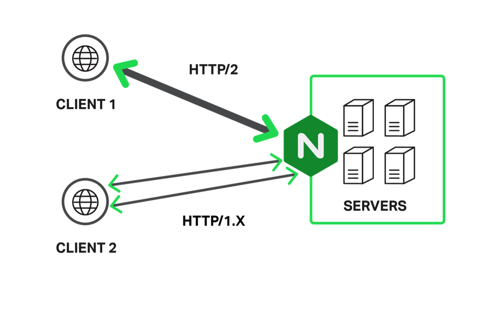

# research-project
 

## Preface
####  Developed by Ryan Dahl pada tahun 2009
####  Server Side Java Script
####  Built on Google’s V8 engine
####  An environment for developing high performance web services
####  Using event-driven, asynchronous I/O to minimize overhead and maximize scalability.
####  The goal is to provide an easy way to build scalable network servers
 
 Node is a server side JavaScript environment for developing web applications, application servers, any sort of network server or client, and general purpose programming.

 
 
 Node.js is the leading tool for creating server applications in JavaScript, the world’s most popular programming language. Offering the functionality of both a web server and an application server, Node.js is now considered a key tool for all kinds of microservices‑based development and delivery. 
 
 Node.js is single‑threaded and uses nonblocking I/O, allowing it to scale and support tens of thousands of concurrent operations. It shares these architectural characteristics
 

 
  Designed for high concurrency
  Without threads or newa processes
  Never blocks, not even for I/O
  Runs over the command line  
  Uses the CommonJS framework
  Making it a little closer to a real OO language
  
  ## Server-side JavaScript

  
Commonly JavaScript, jQuery was all still fronted stuff.
Node.js was JavaScript on the server.
It allows you to run JavaScript code in the backend, outside a browser.
Using runtime environment (Google’s V8 VM) and library (Node.js ships)

 ## What’s Node.js (cont’d)
 
  The Node model is very different from common application server platforms that scale using threads. The claim is that, because of the event-driven architecture, memory footprint is low, throughput is high, and the programming model is simpler.  
  The Node platform is in a phase of rapid growth, and many are seeing it as a compelling alternative to the traditional—Apache, PHP, Python, an so on—approach to building web applications. 

  Unlike in most other modern environments, a Node process doesn’t rely on multithreading to support concurrent execution of business logic, it’s based on an asynchronous I/O event-driven model. 
  
  
### What Can You Do  With Node ?
   
   It is a command line tool. You download a tarball, compile and install the source 
   
   It lets you run JavaScript programs by typing ‘node_my_apps.js” in your terminal
  
   It lets you Layered on top of the TCP library is a HTTP and HTTPS client/server 

  The JS executed by the V8 javascript engine (the ting that makes Google Chrome so fast)
Node provides a JavaScript API to access the network and file system.

## What can't Do With Node

  Node is a platform for writing JavaScript applications outside web browsers. This is not the JavaScript we are familiar with in web browsers. There is no DOM built into Node, nor any other browser capability. 
 
  One thing Node cannot do is desktop GUI applications. Today, there is no equivalent for Swing built into Node, nor is there a Node add-on GUI toolkit, nor can it be embedded in a web browser. 
  
  ## Why should use Node
  
   JavaScript is the popular language of the web
   
 “Global Object” as the main disadvantages of JavaScript, which can create an unruly chaos when mixing modules together
CommonJS module system from Node that make local variables are truly local

 Web applications spend most of their time doing I/O
Can implement the same programming language on client and server

## Node Potential Wins

The same programming staff can work on both ends of the wire

Code can be migrated between server and client more easily

Common data formats (JSON) between server and client

Common software tools for server and client

Common testing or quality reporting tools for server and client

When writing web applications, view templates can be used on both sides

Similar languaging between server and client teams

  
## Concurrency: The Event Loop
 
  Instead of threads Node uses an event loop with a stack
  Alleviates overhead of context switching
 
 
 
 
 

 
 
 ## Event Loop Example 
 
   Request for “index.html” comes in
   Stack unwinds and ev_loop goes to sleep
   File loads from disk and is sent to the client

 ### Non Blocking I/O

  Servers do nothing but I/O
  Scripts waiting on I/O requests degrades performance
   To avoid blocking, Node makes use of the event driven nature of JS by attaching callbacks to I/O requests
  Scripts waiting on I/O waste no space because they get popped off the stack when their non-I/O related code finishes executing

 

### Consistancy 

  Use of JS on both the client and server-side should remove need to “context switch”
  Client-side JS makes heavy use of the DOM, no access to files/databases
  Server-side JS deals mostly in files/databases, no DOM
  JS Dom project for Node works for simple tasks, but not much else

 

Threads VS Event-driven

Events avoid concurrency as much as possible, threads embrace:
Easy to get started with events: no concurrency, no preemption, no synchronization, no deadlock
Use complicated techniques only for unusual cases
With threads, even the simplest application faces the full complexity.
Debugging easier with events:
Timing depedencies only related to events, no to internal schedulling.
Problems easier to track down

Events faster than threads on single CPU
No locking overheads
No context switching
Events more portable than threads
Threads provide true concurrency
Can have long-running stateful handlers without freezes
Scalable performance on multiple CPUS

Platform|Asynchronous Event-driven
------------ | -------------
Lock application / request with listener-workers threads | only one thread, which repeatedly fetches an event
Using incoming-request model| Using queue and then processes it
multithreaded server might block the request which might involve multiple events| manually saves state and then goes on to process the next event
Using context switching|no contention and no context switches
Using multithreading environments where listener and workers threads are used frequently to take an incoming-request lock|Using asynchronous I/O facilities (callbacks, not poll/select or O_NONBLOCK) environments

## Why Thread Are A Bad Idea
(for high-concurrency servers)

Performance : Many attempts to use threads for high concurrency have not performed well.
Control Flow: Threads have restrictive control flow

Synchronization: Thread synchronization mechanisms are too heavyweight

State Management: Threads stacks are an ineffective way to manage live state

Scheduling: The virtual processor model provided by threads forces the runtime system to be too generic and prevents it from making optimal schedulling decisions 

## Performance and Utilization

The http object encapsulates the HTTP protocol and its http.createServer method creates a whole web server, listening on the port specified in the .listen method. Every request (whether a GET or PUT on any URL) on that web server calls the provided function. It is very simple lightweight. In this case, regardless of the URL, it returns a simple text/plain “Hello World” response. 

Because of its minimal nature, this simple application should demonstrate the maximum request throughput of Node. Indeed many have published benchmark studies starting from this simplest of HTTP servers. 

## System Requirements

Node runs best on the POSIX-like operating systems. These are the various UNIX derivatives (Solaris, and so on) or workalikes (Linux, Mac OS X, and so on).

While Windows is not POSIX compatible, Node can be built on it either using POSIX compatibility environments (in Node 0.4x and earlier). 

## Node Js VS Apache

1. It's fast
1. It can handle tons of concurrent requests
1. It's written in JavaScript (which means you can use the same code server side and client side)

Platform|Number of request per second
------------ | -------------
PHP ( via Apache) | 3187,27
Static ( via Apache ) | 2966,51
Node.js |  5569,30

 
Lock application / request with listener-workers threads |  only one thread, which repeatedly fetches an event
Using incoming-request model  |  Using queue and then processes it
multithreaded server might block the request which might involve multiple events|manually saves state and then goes on to process the next event
Using context switching|no contention and no context switches
Using multithreading environments where listener and workers threads are used frequently to take an incoming-request lock|Using asynchronous I/O facilities (callbacks, not poll/select or O_NONBLOCK) environments

#### Node.js is a great tool for creating and running application logic that produces the core, variable content for your web page. But it’s not so great for serving static content – images and JavaScript files, for example – or load balancing across multiple servers.

##### To get the most out of Node.js, you need to cache static content, to proxy and load balance among multiple application servers, and to manage port contention between clients, Node.js, and helpers, such as servers running Socket.IO. NGINX can be used for all of these purposes, making it a great tool for Node.js performance tuning.

1. Implement a reverse proxy server

 

1. Cache static files
1. Load balance traffic across multiple servers
1. Proxy WebSocket connections

 

1. Implement SSL/TLS and HTTP/2

 

 

